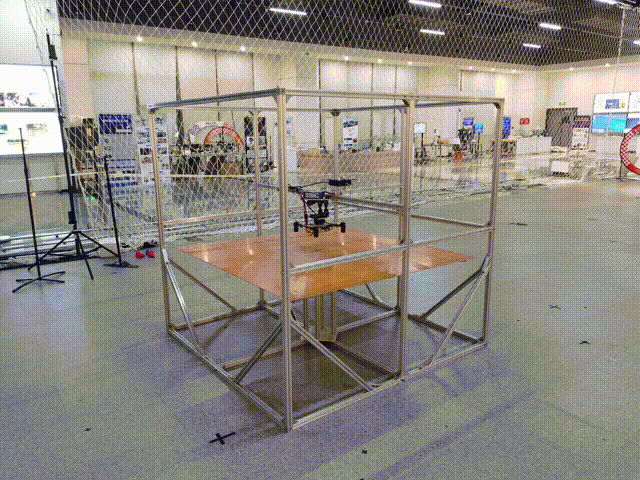
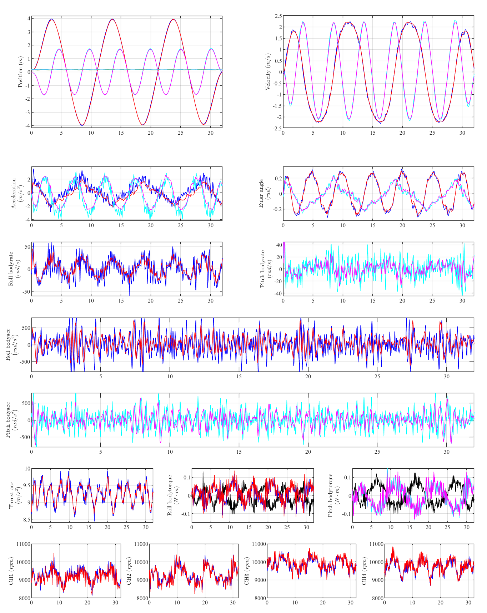

# Ground-effect-controller

**Supplementary material** for the paper: Ground-Effect-Aware Modeling and Control for Multicopters.

    

    

	
The detailed data in the above video is in the [Part.5. Control algorithm](##Control)

## 1. The quadrotor

### 1.1. Firmware for the flight controller 

This firmware is included in a [***VMware***](https://www.vmware.com/) virtual machine environment.

Downlink:  [***Fireware with virtual environment***](http://zjufast.tpddns.cn:9110/share.cgi?ssid=cfde8ecbb0b8432fb59c241b98ab59a9)

Downlink:  [***Fireware***](http://zjufast.tpddns.cn:9110/share.cgi?ssid=d6dd0e1a97cf43f7a9f5feb82fca04d5)

Password: fastlab@2024

### 1.2. Devices

Flight controller: [***CUAV V5***](https://doc.cuav.net/flight-controller/v5-autopilot/en/v5+.html)

Lattice laser sensor: [***Laser***](https://www.nooploop.com/tofsense-m/)

Onboard computer: [***Intel NUC***](https://www.intel.com/content/www/us/en/products/sku/205603/intel-nuc-11-pro-kit-nuc11tnki5/specifications.html)

Motion capture system: [***NOKOV***](https://en.nokov.com/products/motion-capture-cameras/Mars.html)

### 1.3. CAD model

The [***CAD model***](./CAD/quadrotor.STEP) of  the  quadrotor in this paper.

    

    

### 1.4. BOM list

| **Type**                         | **Name**                                   | **Mass (g)** | **Quantity** | **Gross Mass (g)** |
| -------------------------------- | ------------------------------------------ | ------------ | ------------ | ------------------ |
| **Rack**                         | Upper center plate                         | 112.80       | 1            | 112.80             |
|                                  | Lower center plate                         | 150.00       | 1            | 150.00             |
|                                  | Flight controller base PCB                 | 14.00        | 1            | 14.00              |
|                                  | Flight controller core PCB                 | 10.50        | 1            | 10.50              |
|                                  | Flight controller                          | 41.30        | 1            | 41.30              |
| **Rack mounting**                | M3 Lockout nuts                            | 0.40         | 20           | 8.00               |
|                                  | M3 Isolation column (6mm)                  | 0.18         | 20           | 3.56               |
|                                  | M3 screw (16mm)                            | 1.04         | 20           | 20.80              |
| **Undercarriage**                | Landing gear carbon clamp                  | 4.90         | 4            | 19.60              |
|                                  | Landing gear carbon tube spacer            | 4.23         | 4            | 16.93              |
|                                  | Landing gear carbon tube                   | 2.50         | 4            | 10.00              |
|                                  | Landing gear carbon tube sponge cylinder   | 3.25         | 4            | 13.00              |
|                                  | Landing gear carbon tube sponge round pad  | 0.40         | 4            | 1.59               |
|                                  | Motor                                      | 45.00        | 4            | 180.00             |
|                                  | Paddle (7 inches)                          | 7.50         | 4            | 30.00              |
|                                  | M3 screw (20mm)                            | 1.23         | 16           | 19.68              |
| **Onboard computer and battery** | 3D printed parts (on-board computer fixed) | 56.50        | 1            | 56.50              |
|                                  | Intel NUC                                  | 494.20       | 1            | 494.20             |
|                                  | SSD                                        | 8.80         | 1            | 8.80               |
|                                  | RAM                                        | 8.20         | 2            | 16.40              |
|                                  | Battery 22.2V 1400mAh                      | 233.80       | 1            | 233.80             |
|                                  | Reflector bracket                          | 31.50        | 1            | 31.50              |
|                                  | Reflective (25mm)                          | 6.52         | 5            | 32.60              |
| **Laser sensor and fixation**    | M3 screw (10mm)                            | 0.77         | 8            | 6.16               |
|                                  | M3 Lockout nuts                            | 0.40         | 8            | 3.20               |
|                                  | M3 screw (16mm)                            | 1.04         | 4            | 4.16               |
|                                  | M3 Isolation column (6mm)                  | 0.18         | 4            | 0.71               |
|                                  | M3 single pass aluminum column (12mm)      | 0.60         | 4            | 2.40               |
|                                  | M3 Lockout nuts                            | 0.40         | 4            | 1.60               |
|                                  | Laser sensors fix carbon plates            | 10.60        | 1            | 10.60              |
|                                  | Laser sensor                               | 8.30         | 1            | 8.30               |
| **Total**                        |                                            |              |              | **1562.70**        |

## 2. The quadrotor platform for model validation

### 2.1. CAD model

The  [***CAD model***](./CAD/platform.step)  of the force measurement platform in this paper.

    

    

    

### 2.2. Platform data: The leveling torque

The following [***figure***](./figs/getorque_all_rpmmodel.pdf) shows the data in the leveling torque experiment. The figure shows the relationship between leveling torque **${{\bf{\tau }}_G}$** and average rotor speed **$\left\| {{n_i}} \right\|$**. The black points are sensor data and the blue lines are model-fitting results.

    

### 2.3. Platform data: ROS bags and processing

To be uploaded.

## 3. Motor calibration and rotor speed control

### 3.1. Motor model

To control the rotors to the desired speeds, the rotors need to be modeled and calibrated.

The thrust **$T_i$** and torque **$M_i$** generated by a single rotor are:

**$$T_i = k_T n_i^2,$$**

**$${M_i} = {k_I}{n^2} + {J_R}{{\dot n}_i}.$$**

- **$k_T$** is the thrust coefficient,
- **$k_I$** is the torque coefficient,
- **$J_R$** is the moment of inertia of the rotor,
- **$i$** is the rotor number.

​      The following  [***figure***](./figs/sigle_motor_platform.pdf) is the calibration of the (a)thrust and (b)torque model with the single motor platform in the paper.  The static/dynamic modelmeans: without/with a differential term of rotor speed **$\dot{n}$**. 

    

### 3.2. Throttol model of the flight controller

The rotor speeds are controlled through the throttle input (**$t_i^{des} \in \left[ {0,1} \right]$**), and the rotational speeds are fed back through  [***BDhot***](https://ardupilot.org/copter/docs/common-dshot-escs.html).
When the flight controller receives a throttle control signal (**${t_c} \in [0,1]$**), the rotor speed will be maintained at a roughly determined value. The relationship between the rotor speed and the throttle, after eliminating the influence of battery voltage, is usually a quadratic function:

**$$n_{esc}(t_c) = c_2 t_c^2 + c_1 t_c + c_0.$$**

We collect rotor speed and throttle data on the single-motor platform and calibrate the model. The data is illustrated in the following [***figure***](./figs/id_single_motor.pdf).

- (a) The relationship between rotor speed $n$ and throttle $t_c$. 
- (b) The time series of motor speed, with the blue line representing the speed predicted using the throttle model.

    

It can be seen that the data demonstrates a strong alignment with the model.

### 3.3. Rotor speed control

The rotor speeds require closed-loop control; however, we do not implement this control for each motor individually. Instead, we apply closed-loop control to the combined acceleration generated by all rotors along **${\bf{z}}_B$**. The control method for rotor speed is:

**$$
t_i^{des} = t_i^{ref} + t_E,
$$**

**$$
t_i^{ref} = n_{esc}^{ - 1}(n_i), 
$$**

**$$
t_E = K_P^T T_a^E + K_I^T \sum T_a^E,
$$**

**$$
T_a^E = \left( {\sum\limits_i {{k_T}n{{_i^{des}}^2}}  - \sum\limits_i {{k_T}{n_i}^2} } \right)/m
$$**

- **$t_i^{ref}$** is the feedforward throttle obtained by **$n_{esc}^{ - 1}$**, the inverse function of throttol model, 
- **$t_E$** is the throttle from rotor speed error,
- **$T_a^E$** is the acceleration error by all rotors,
- **$K_P^T$**, **$K_I^T$** are the parameters of the Proportional-Integral controller.

## 4. Parameters

### 4.1. Parameter calibration

The results of parameter identification in the paper are shown in following table:

| **Symbol**   | **Value**                                                    | **Name**                             | **Method**              |
| ------------ | ------------------------------------------------------------ | ------------------------------------ | ----------------------- |
| **$k_T$**    | $4.0083 \times 10^{-8} \, \text{N/rpm}^2$                    | Thrust coefficient                   | Single-rotor platform   |
|              | $3.7840 \times 10^{-8} \, \text{N/rpm}^2$                    |                                      | Quadrotor platform      |
|              | $4.2958 \times 10^{-8} \, \text{N/rpm}^2$                    |                                      | Real flight by hovering |
| **$k_{TX}$** | $4.678 \times 10^{-8} \, \text{N/rpm}^2$                     | Torque by thrust coefficient (roll)  | Quadrotor platform      |
| **$k_{TY}$** | $3.588 \times 10^{-8} \, \text{N/rpm}^2$                     | Torque by thrust coefficient (pitch) |                         |
| **$k_I$**    | $6.3859 \times 10^{-10} \, \left( \text{N} \cdot \text{m} \right) / \text{rpm}^2$ | Rotor torque coefficient             | Single-rotor platform   |
| **$J_R$**    | $1.0556 \times 10^{-4} \, \text{kg/m}^2$                     | Rotor inertia                        | Single-rotor platform   |
| **$g_1$**    | $1.804 \times 10^{-2}$                                       | Ground effect coefficient            | Quadrotor platform      |
| **$g_2$**    | $7.339 \times 10^{-3}$                                       |                                      |                         |
| **$g_3$**    | $-3.365 \times 10^{-1}$                                      |                                      |                         |
| **$g_4$**    | $4.126 \times 10^{-2}$                                       |                                      |                         |
| **$g_5$**    | $6.494 \times 10^{-2}$                                       |                                      |                         |
| **$c_2$**    | $-1.448471 \times 10^8$                                      | Throttle curve parameter             | Quadrotor platform      |
| **$c_1$**    | $5.228928 \times 10^8$                                       |                                      |                         |
| **$c_0$**    | $1.033111 \times 10^8$                                       |                                      |                         |
| **$d_x$**    | $0.3970 \, \text{N/(m/s)}$                                   | Rotor drag coefficient               | Real flight             |
| **$d_y$**    | $0.3300 \, \text{N/(m/s)}$                                   |                                      |                         |
| **$m$**      | $1.696 \, \text{kg}$                                         | Mass of the quadrotor                | Electronic scale        |
|              | $1.562 \, \text{kg}$                                         |                                      | Mechanical model        |
| **$I_x$**    | $0.00745220 \, \text{kg/m}^2$                                | Inertia of the quadrotor             | Mechanical model        |
| **$I_y$**    | $0.00792752 \, \text{kg/m}^2$                                |                                      |                         |
| **$I_z$**    | $0.01249522 \, \text{kg/m}^2$                                |                                      |                         |

### 4.2. Spearman's rank correlation

The following table shows the Spearman's rank correlation coefficient between variables.

- **$\uparrow $** : Strong correlation;
- **$\downarrow$** : Weak correlation.

| **Spearman coefficient**          | ${{\bf{x}}_W}^ \top {{\bf{\tau }}_B}$ | ${{\bf{z}}_W}^ \top {{\bf{\tau }}_B}$ | ${{\bf{y}}_W}^ \top {{\bf{\tau }}_G}$ | ${{\bf{y}}_W}^ \top {{\bf{\tau }}_G}/\sin \delta$ | ${{\bf{f}}_{\bf{G}}}$ |
| --------------------------------- | ------------------------------------- | ------------------------------------- | ------------------------------------- | ------------------------------------------------- | --------------------- |
| ${\bf{N}_{base}}\left( 1 \right)$ | -                                     | -                                     | $\uparrow -0.6640$                    | -                                                 | $\uparrow +0.4703$    |
| ${\bf{N}_{base}}\left( 2 \right)$ | $\uparrow +0.8245$                    | -                                     | -                                     | -                                                 | -                     |
| ${\bf{N}_{base}}\left( 3 \right)$ | -                                     | -                                     | -                                     | -                                                 | -                     |
| ${\bf{N}_{base}}\left( 4 \right)$ | -                                     | $\uparrow +0.9251$                    | -                                     | -                                                 | -                     |
| $h$                               | $\downarrow +0.0284$                  | $\downarrow +0.1781$                  | $\uparrow +0.3384$                    | -                                                 | $\uparrow -0.5465$    |
| $\delta$                          | -                                     | -                                     | -                                     | $\downarrow +0.0930$                              | $\downarrow +0.0054$  |

## Control

The  following [***figure***](./figs/traj_rmse_plot.pdf) shows the curves of Exp.~7($3m/s$, near-ground) in the paper. Every loop is well-controlled, including the rotor speed, thrust acceleration, body torque, etc.

    

	

    

    

## 6. Future work

The fluid simulation work is in progress.

