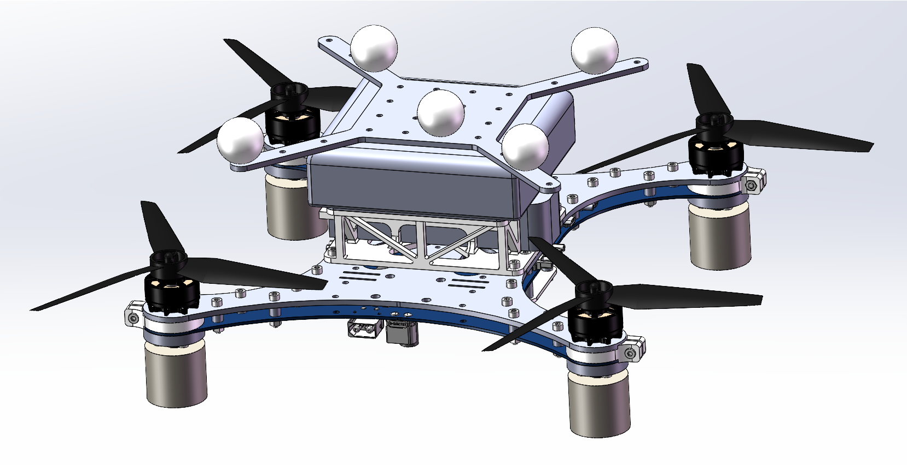

# Ground-effect-controller

Ground-Effect-Aware Modeling and Control for Multicopters.

Paper (to be uploaded)

Video (to be uploaded)

## Firmware for the flight controller 

This firmware is included in a [VMware](https://www.vmware.com/) virtual machine environment.

Downlink:  [Fireware with virtual environment](http://zjufast.tpddns.cn:9110/share.cgi?ssid=cfde8ecbb0b8432fb59c241b98ab59a9)

Downlink:  [Fireware only](http://zjufast.tpddns.cn:9110/share.cgi?ssid=d6dd0e1a97cf43f7a9f5feb82fca04d5)

Password: fastlab@2024

## The quadrotor

### CAD model

The CAD model of  the [quadrotor](./CAD/quadrotor.STEP)  in this paper.

### BOM list

| **Type**                         | **Name**                                   | **Mass (g)** | **Quantity** | **Gross Mass (g)** |
| -------------------------------- | ------------------------------------------ | ------------ | ------------ | ------------------ |
| **Rack**                         | Upper center plate                         | 112.80       | 1            | 112.80             |
|                                  | Lower center plate                         | 150.00       | 1            | 150.00             |
|                                  | Flight controller base PCB                 | 14.00        | 1            | 14.00              |
|                                  | Flight controller core PCB                 | 10.50        | 1            | 10.50              |
|                                  | Flight controller                          | 41.30        | 1            | 41.30              |
| **Rack mounting**                | M3 Lockout nuts                            | 0.40         | 20           | 8.00               |
|                                  | M3 Isolation column (6mm)                  | 0.18         | 20           | 3.56               |
|                                  | M3 screw (16mm)                            | 1.04         | 20           | 20.80              |
| **Undercarriage**                | Landing gear carbon clamp                  | 4.90         | 4            | 19.60              |
|                                  | Landing gear carbon tube spacer            | 4.23         | 4            | 16.93              |
|                                  | Landing gear carbon tube                   | 2.50         | 4            | 10.00              |
|                                  | Landing gear carbon tube sponge cylinder   | 3.25         | 4            | 13.00              |
|                                  | Landing gear carbon tube sponge round pad  | 0.40         | 4            | 1.59               |
|                                  | Motor                                      | 45.00        | 4            | 180.00             |
|                                  | Paddle (7 inches)                          | 7.50         | 4            | 30.00              |
|                                  | M3 screw (20mm)                            | 1.23         | 16           | 19.68              |
| **Onboard computer and battery** | 3D printed parts (on-board computer fixed) | 56.50        | 1            | 56.50              |
|                                  | Intel NUC                                  | 494.20       | 1            | 494.20             |
|                                  | SSD                                        | 8.80         | 1            | 8.80               |
|                                  | RAM                                        | 8.20         | 2            | 16.40              |
|                                  | Battery 22.2V 1400mAh                      | 233.80       | 1            | 233.80             |
|                                  | Reflector bracket                          | 31.50        | 1            | 31.50              |
|                                  | Reflective (25mm)                          | 6.52         | 5            | 32.60              |
| **Laser sensor and fixation**    | M3 screw (10mm)                            | 0.77         | 8            | 6.16               |
|                                  | M3 Lockout nuts                            | 0.40         | 8            | 3.20               |
|                                  | M3 screw (16mm)                            | 1.04         | 4            | 4.16               |
|                                  | M3 Isolation column (6mm)                  | 0.18         | 4            | 0.71               |
|                                  | M3 single pass aluminum column (12mm)      | 0.60         | 4            | 2.40               |
|                                  | M3 Lockout nuts                            | 0.40         | 4            | 1.60               |
|                                  | Laser sensors fix carbon plates            | 10.60        | 1            | 10.60              |
|                                  | Laser sensor                               | 8.30         | 1            | 8.30               |
| **Total**                        |                                            |              |              | **1562.70**        |

## The force measurement platform

The  [CAD model](./CAD/platform.step)  of the force measurement platform in this paper.

## Control algorithm

The control algorithm that runs on the onboard computer (to be uploaded).

